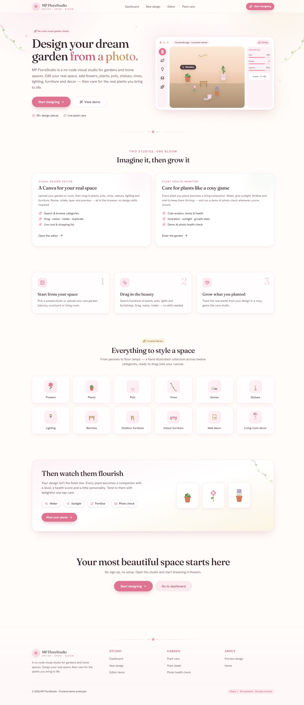
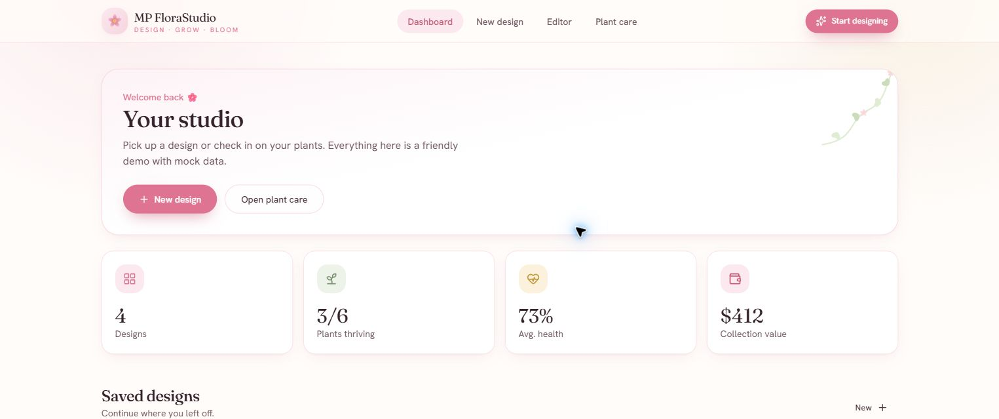
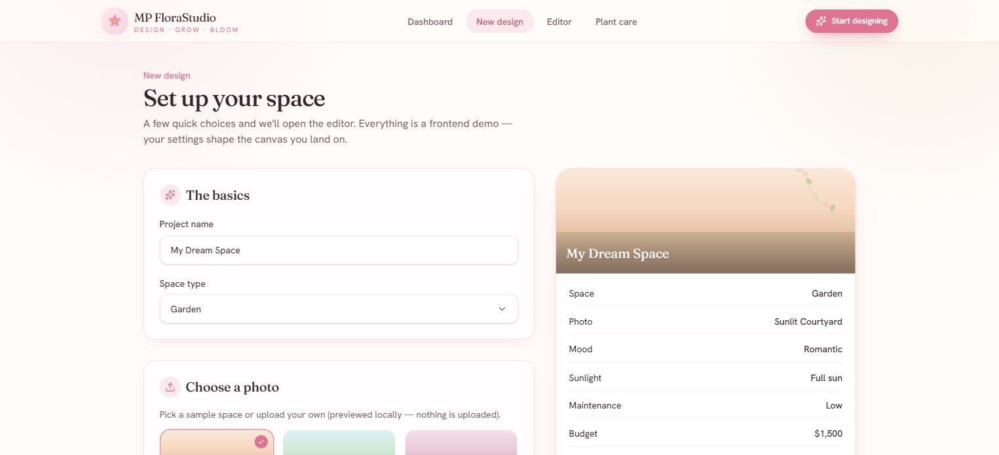
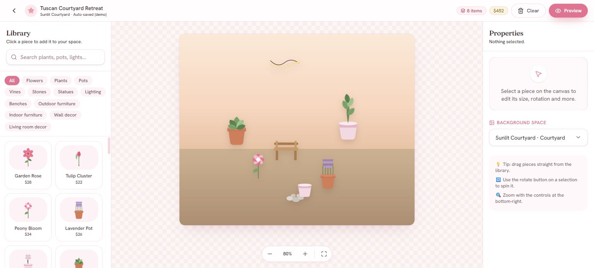
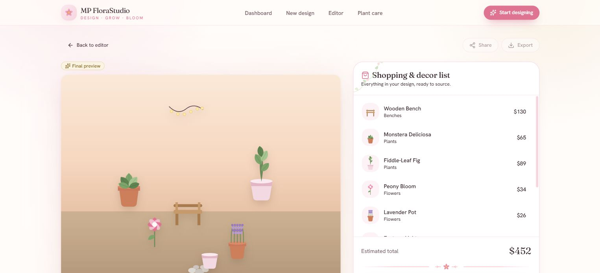
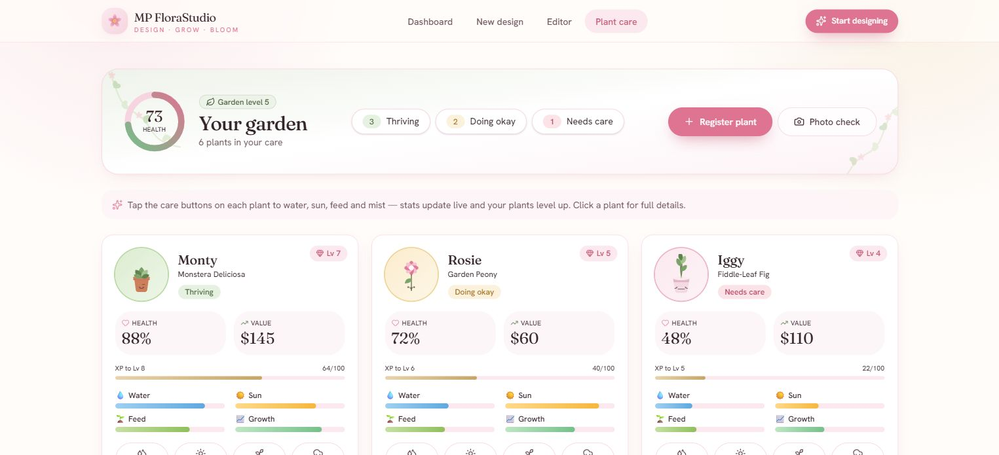
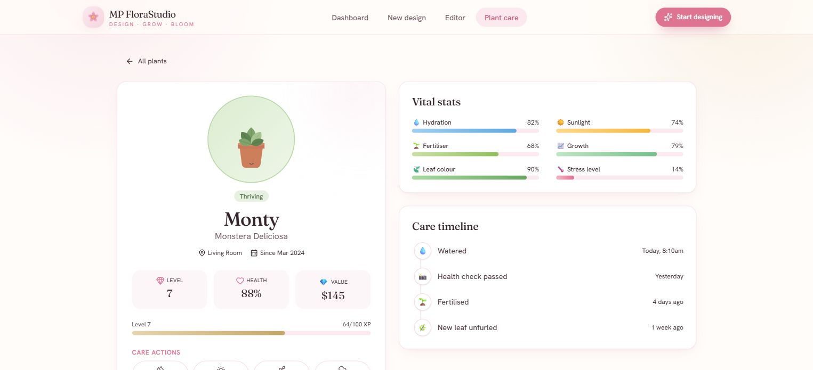
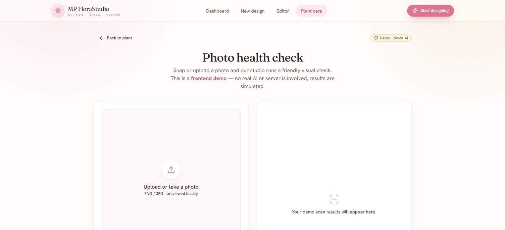

# 🌸 MP FloraStudio

> **A cute, techy garden sidekick inspired by my mum, her plants, and a few too many mysterious plant deaths.** 🌱🎮

<p align="center">
  <a href="https://mp-florastudio.vercel.app/"><strong>🌐 Open the live app</strong></a>
  &nbsp;·&nbsp;
  <a href="https://mp-florastudio.vercel.app/design/demo/editor"><strong>🎨 Try the editor</strong></a>
  &nbsp;·&nbsp;
  <a href="https://mp-florastudio.vercel.app/plants"><strong>🌱 Meet the plants</strong></a>
</p>



## 🌱 Why I built this

This idea started with my mum. She loves her garden and is always trying new
plants to make it look beautiful. Sometimes a plant would suddenly die and she
had no idea why. Too much water? Not enough sun? Wrong spot? Plant drama?
Nobody knew.

So, as her son and the techy one in the family, I wanted to build something for
her. MP FloraStudio helps her imagine a garden before moving everything around,
monitor the plants she brings home, and understand what each one needs.

It is part garden design studio, part plant-care sidekick, and part cosy game.
The goal is simple: make plant care less confusing and much more fun. 🌸

## ✨ What makes it special

- **Design first, care second:** create a dream space, then keep its living plants healthy in the same experience.
- **No-code visual editor:** add, drag, resize, rotate, layer, duplicate and preview garden pieces directly in the browser.
- **A cosy game loop:** plants have names, levels, health, XP, value and one-tap care actions.
- **Useful health signals:** hydration, sunlight, fertiliser, growth, leaf colour and stress turn plant care into something visible.
- **From mood board to shopping list:** the final preview connects each design choice to an item and estimated cost.
- **Friendly photo-check concept:** a clearly labelled mock scan demonstrates how future computer vision could explain plant problems.
- **A complete frontend prototype:** eight connected screens, responsive UI, local interactions and no sign-up required.

## 🎨 Product tour

### 1. Landing page: understand the whole idea at a glance

The home page introduces the two connected studios: visual garden design and
game-like plant care. It gives visitors a direct path into either experience.


### 2. Dashboard: one home for spaces and plants

The dashboard brings saved designs, garden health and collection value into one
view. Its purpose is to make the product feel like an ongoing personal studio,
not a one-time design tool.



### 3. New design setup: shape the garden before editing

Users choose the space, starting photo, mood, sunlight, maintenance level and
budget. A live summary turns a few friendly choices into a clear design brief.



### 4. Visual editor: the main creative playground

This is the core selling point. Users browse twelve categories, place pieces on
their real space, then drag, resize, rotate, layer and style the result. The
library, canvas and properties panel keep the workflow visual and approachable.



### 5. Final preview: turn a design into an actionable plan

The finished space appears beside a shopping and decor list with individual
prices and an estimated total. It closes the gap between inspiration and what
someone would actually need to build the garden.



### 6. Plant garden: care feels like a cosy game

Every plant becomes a character with a name, level, health score, value and XP.
At-a-glance care bars make it obvious which plants are thriving and which need
attention.



### 7. Plant detail: useful signals without the overwhelm

The detail view combines six vital stats with a care timeline. It shows what is
happening now and what was done recently, giving each plant a simple health
story instead of a wall of gardening jargon.



### 8. Photo health check: a future AI direction

Users can preview a plant photo locally and explore a simulated health-check
flow. Phase 1 labels this clearly as mock AI, while demonstrating where a real
vision model could later detect symptoms and suggest care.



## ⚠️ Phase 1: frontend prototype

The live app is a self-contained frontend demo built to prove the product idea
and interaction design. It currently uses local React state, `sessionStorage`
and mock data.

Phase 1 does not include authentication, a database, persistent accounts,
server APIs, real AI inference, checkout or notifications. The photo health
check is intentionally labelled as a simulation.

## 🧰 Tech stack

- **Next.js App Router** with **TypeScript**
- **Tailwind CSS v4** with custom design tokens
- **Radix UI** and shadcn-style primitives
- **react-rnd** for canvas dragging and resizing
- **lucide-react** icons and **sonner** notifications
- Hand-crafted SVG illustrations and CSS gradients

## 🚀 Run locally

```bash
npm install
npm run dev
```

Open `http://localhost:3000`.

For a production check:

```bash
npm run build
npm start
```

Requires Node 18.18 or newer.

## 🔭 Where it can grow next

- Real image-based plant health detection with explainable care suggestions
- Accounts, saved gardens and long-term plant history
- Weather-aware reminders and notifications
- A real plant and decor catalogue with sourcing links
- Garden growth progress and seasonal recommendations

---

_Made for my mum, her garden, and every plant that deserves a better chance._ 🌷
